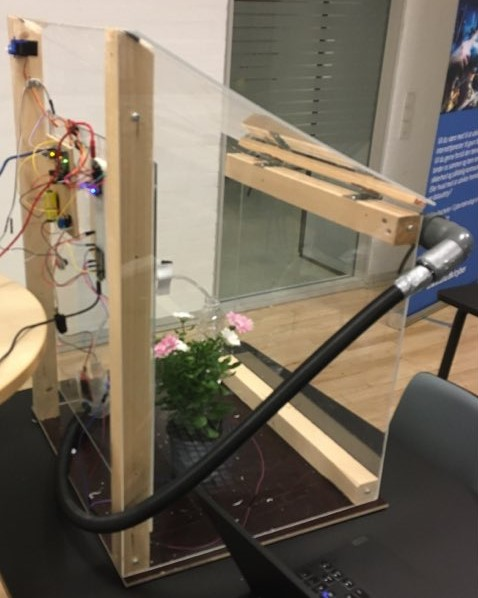
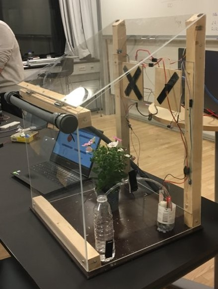

# SmartVeggies
A smart Greenhouse with Thingspeak connectivity using an Arduino microcontroller

## Motivation
Project for the DTU IoT course (34315): IoT, application and infrastructure development.

## Components
https://arduinotech.dk/shop/most-complete-starter-kit-uno-r3/
https://arduinotech.dk/shop/automatic-watering-system-diy-set-a/
ESP8266
The physical structure was built using material from the DTU workshop.

## Images

